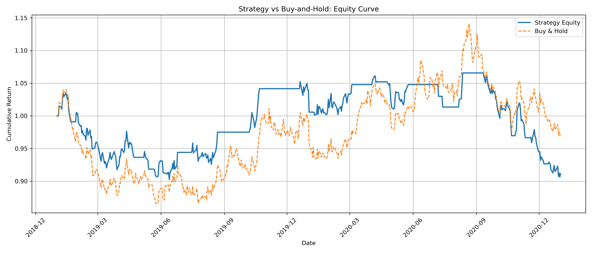
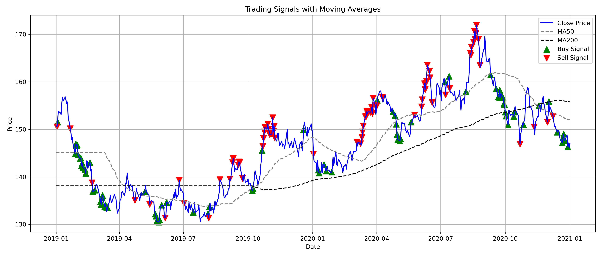

# MACD + RSI Based Quantitative Trading Strategy

This project implements a simple long-only trading strategy using a combination of trend-following (MACD) and mean-reversion (RSI) signals. The backtest is conducted on historical QQQ ETF data from 2019 to 2021.

## Strategy Logic

- **Buy** when:
  - MACD line crosses above the signal line (bullish momentum)
  - or RSI falls below 30 (oversold)
- **Sell** when:
  - MACD line crosses below the signal line
  - or RSI rises above 70 (overbought)
- Daily rebalancing, position = 1 (long) or 0 (flat)

## Backtest Results

- **Cumulative Return**: -8.84%
- **Annualized Return**: -6.93%
- **Sharpe Ratio**: -0.33
- **Max Drawdown**: -14.94%

## Parameter Tuning

- Grid search over:
  - RSI window: 10, 14, 20
  - Oversold threshold: 25, 30
- **Best Sharpe Ratio**: 1.49 with window=20, threshold=25

## Visualizations

## 🛠 Tech Stack

- Python (Pandas, Matplotlib)
- Data source: `yfinance`
- Single asset: QQQ

## Files

- `Quant_trader.py`: Full strategy logic
- `QQQ_2019_2021.csv`: Backtest data
- `img/`: Visualizations
